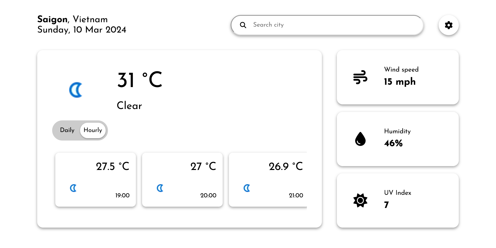

# Weather Man: A Weather Web-App

A web app displaying weather information from all over the places using WeatherAPI. This project is an assignment from TheOdinProject.

[Live App](https://69kwan69.github.io/weather/)

## Features

### Display weather information

Weather Man can show basic weather information (temperature, wind speed, humidity, uv index, etc), as well as forecast hourly and daily, based on the user's location or manual searching.

### Customize settings

User can change between weather units system depend on their regions.

## Knowing the limit

Currently the quality of icons is horrible. This can be enhanced with API subscription, which I'm not planning to (I'm not paying for an assignment)

## Future features

I'm considering making Weather Man more dynamic like **changing the background** based on the location's weather status (a bright, playful photo in the background on a sunny day). Or maybe a **theme switcher** in the settings.
